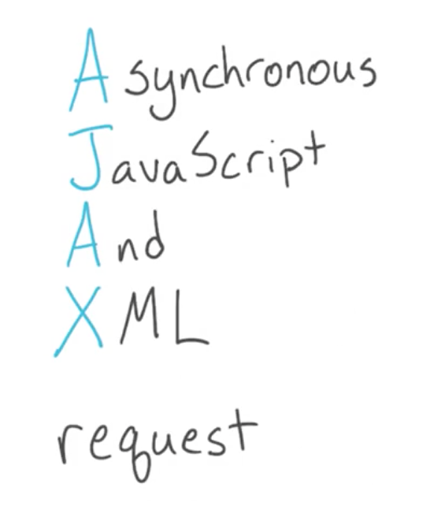
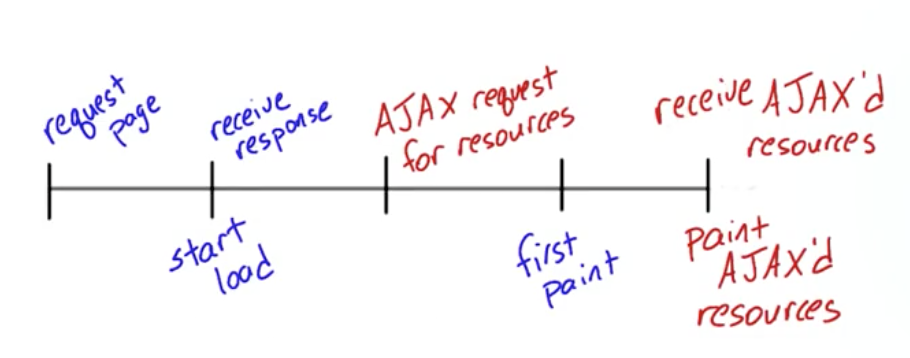
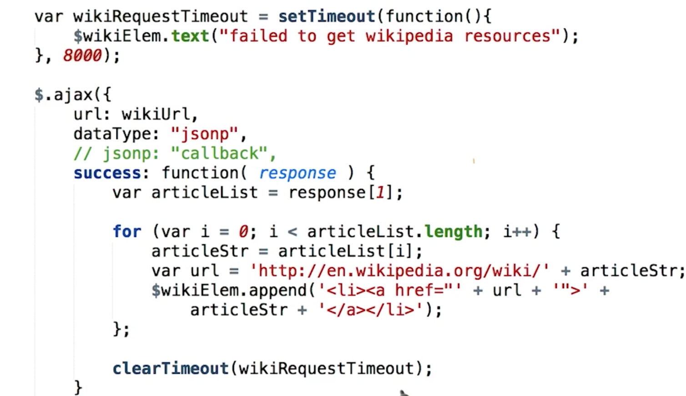

# ajax

## what is it

## what it can do

- load content without reloading .
- allow for data to be received asynchronously.

## request asynchronously

ajax can allow requests asynchronously which means they can happen in the background without blocking the rest of the page load. The page keep on doing his things and only acts on the data only when it gets returned by server 。

## example

瀑布流异步加载 facebook 人人网

## doc

http://api.jquery.com/jquery.ajax/

http://api.jquery.com/jquery.getjson/

## CORS and JSON-P

> [CORS（Cross Origin Resource Sharing）](http://en.wikipedia.org/wiki/Cross-origin_resource_sharing)
>
> ###### jsonp 没有处理错误的机制
>
> 可以变通一下 ， 当请求时间过长的时候，我们可以用一个setTimeout来停止请求。当然， 要配合好 clearTimeout.
>
> 
>
> CORS 采用有时过于严格的浏览器策略，旨在保护服务器不受恶意请求损害。CORS 在服务器端启用，因此你通常无需担心它是否适用于代码。但你不需要知道，因为有些 API 支持代码，有些则不。
>
> ## 什么是 CORS？我们为什么要使用它？
>
> CORS 采用同源策略。同源策略由 Web 浏览器实施，以防止来自不受信任域的恶意脚本在网站上运行。换句话说，它可确保一个网站的脚本无法自行插入另一个网站。
>
> 例如，同源策略可避免坏人的 JavaScript 以某种方式在你的银行网站上运行并盗取你的信息。
>
> 随着时间的推移，开发人员认识到此策略过于严格，常常会阻碍合理的用例。有许多理由可以服务来自多个域源的内容，因此开发人员发现了一种解决方法。
>
> 维护服务器端 API 的开发人员可以在其服务器上启用 CORS，以禁用同源策略。CORS 是相对较新地添加至浏览器的功能。服务器返回特定标题时，浏览器会允许发生跨域请求。
>
> 对于不支持 CORS 的 API，你可能需要使用其他方法。有关同源策略的另一种方法是 JSON-P。JSON-P 是允许跨域请求的一种独特技巧。许多 API 都允许你提供回调函数名称，它们会生成在浏览器中运行时将数据传递至该函数的 JavaScript 文件。
>
> 这并不是最简单的无错误实施方法，但如果你要使用 jQuery 创建 AJAX 请求，使用 JSON-P 与向传递至 AJAX 方法的选项对象添加额外属性一样简单。你很快就会执行此操作，我保证，它并不像听起来那么可怕。

